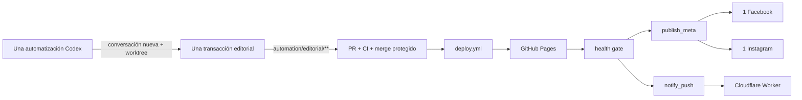

# Arquitectura

## Objetivo

MR Agentes publica una nota útil por día para generar tráfico orgánico hacia la web y sus
perfiles de Facebook e Instagram. La arquitectura aplica KISS: una sola automatización prepara
el contenido y un solo pipeline administrado lo valida, publica y anuncia.

La computadora Linux Mint puede permanecer encendida para que Codex inicie la tarea, pero no es
un servidor de producción. No se agregan cron, systemd, contenedores persistentes ni clones
operativos manuales.

## Autoridades

- Codex y sus automatizaciones nativas investigan y preparan un cambio editorial local.
- GitHub recibe el cambio, ejecuta CI, protege el merge y coordina los efectos.
- GitHub Pages es la única autoridad de publicación web.
- Meta Graph API publica en Facebook e Instagram.
- Cloudflare Worker mantiene suscripciones y entrega Web Push.

El health gate es la frontera: antes de comprobar la URL, el marcador de la nota y su imagen
pública, no existe autoridad para llamar a Meta ni para enviar push.

## Transacción editorial única

`.automation/schedules/editorial.json` es el único descriptor activo. Conserva el ID
`mr-agentes-noticias`, ejecuta todos los días a las 18:00 de `America/Cordoba`, abre una
conversación nueva y usa un worktree dedicado desde `origin/main`.

La única skill es `mragentes-editorial-publisher`. En una misma ejecución:

1. verifica fuentes y deduplica la cola;
2. selecciona 2 o 3 noticias elegibles;
3. crea una nota, una portada y un anuncio social de marca;
4. consume los ítems elegidos y genera manifiesto e informe;
5. valida guards, tests, secretos y Hugo;
6. entrega un único commit remoto atómico y abre un PR.

Si no hay dos noticias fiables, el resultado es `skipped_valid`. Ante checkout sucio o estado
remoto ambiguo, el resultado es `needs_review`. La tarea no conoce secretos y no publica afuera.

## Git y aislamiento

`.automation/github/connector-egress.json` exige el worktree limpio y autoriza sólo ramas
`automation/editorial/**`. El conector crea el cambio con `create_blob` → `create_tree` →
`create_commit` → `update_ref`, un máximo de un commit por corrida y actualización fast-forward.
La automatización no usa git push local, `gh` ni credenciales almacenadas.

`.github/workflows/automation-intake.yml` espera el PR creado por el conector. El evento
`workflow_run` sólo habilita el merge si CI terminó bien y coinciden repositorio, base, rama y
SHA. `--match-head-commit` evita integrar algo diferente de lo validado.

## Datos canónicos

| Dato | Fuente de verdad | Escritor |
|---|---|---|
| cola de noticias | `.automation/news/queue/news-queue.json` | skill editorial |
| manifiesto | `.automation/blog/` | skill editorial |
| nota | `content/notas/` | skill editorial vía PR |
| portada | `static/images/stock/` | skill editorial vía PR |
| anuncio de nota | `static/images/social/notes/` | skill editorial vía PR |
| reporte | `.automation/reports/editorial-YYYY-MM-DD.json` | skill editorial |
| sitio generado | artefacto de Pages | GitHub Actions |
| publicación social | Meta | job `publish_meta` |
| suscripciones y dedupe push | Cloudflare | `cf_worker.js` |

Los drafts `daily_owned` y sus informes históricos se conservan como evidencia, pero ningún
schedule ni workflow los consume. No se crea contenido social independiente del blog.

## Pipeline administrado

`.github/workflows/deploy.yml` contiene todo el recorrido posterior al merge:

1. suites Python y JavaScript;
2. detección tipada de nuevas notas por rango Git;
3. build Hugo y despliegue en GitHub Pages;
4. `wait_for_publication` sobre cada nota nueva;
5. `publish_meta`, dentro de `meta-testing`, para una publicación en Facebook y una publicación
   en Instagram;
6. `notify_push`, dentro de `cloudflare-production`, para un evento Web Push idempotente.

No hay dispatch a workflows secundarios. Los dos efectos usan la misma identidad de nota y se
pueden reintentar por separado. Meta reconcilia publicaciones recientes antes de escribir y
mantiene checkpoints por plataforma. El push usa un token OIDC efímero y un `eventId` estable.

## Web Push

- `assets/js/push.js`: suscripción y baja iniciadas por la persona.
- `static/sw.js`: recepción y apertura segura de la notificación.
- `cf_worker.js`: validación, persistencia, bienvenida y fan-out idempotente.

`PUSH_SUBS` admite claves canónicas `sub:v1:<sha256>` y las claves HTTPS legacy hasta completar
su migración perezosa. Ningún estado de suscriptores vive en el repositorio.

## Fallos seguros

| Fallo | Resultado |
|---|---|
| investigación insuficiente | no crea nota ni PR |
| validación o CI fallida | no integra a `main` |
| deploy o health gate fallido | cero efectos externos |
| Facebook confirmado e Instagram retryable | conserva Facebook y reintenta sólo Instagram |
| resultado Meta incierto | reconcilia; si no es concluyente, `needs_review` |
| push repetido | Cloudflare responde idempotentemente |
| mismo ID con otro hash | conflicto y revisión manual |

La recuperación normal es reejecutar el mismo job fallido del mismo SHA. No existe una
automatización de recuperación paralela.
