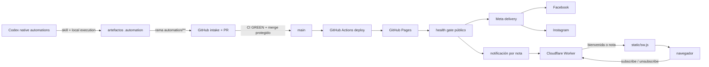

# Arquitectura

## Objetivo y principios

MR Agentes es un sistema editorial event-driven con cinco autoridades bien separadas:

- Codex ejecuta cambios asistidos y mantiene el código y los contratos.
- Sus automatizaciones nativas generan entradas editoriales en el entorno local del proyecto.
- GitHub valida, integra, despliega y coordina efectos posteriores.
- GitHub Pages es la autoridad de la web pública.
- Meta Graph API y Cloudflare Worker son autoridades remotas de social y Web Push.

Ninguna máquina personal funciona como servidor de producción. Puede permanecer encendida para
que la aplicación ejecute tareas programadas, pero la continuidad de la web, las suscripciones y
los efectos posteriores reside en servicios administrados. El sistema no delega trabajo a otra
cuenta, proceso local o intermediario.

Los principios transversales son: TDD, mínimo privilegio, artefactos tipados, publicación sólo
después del despliegue, identidad estable, reconciliación antes de repetir y estado incierto
fail-closed.

## Mapa del sistema

La flecha del health gate es una barrera de autoridad: si Pages no sirve la URL canónica y la
imagen esperadas, no se permite ningún anuncio social ni push de esa nota.

## Plano de control editorial

### Automatizaciones nativas de Codex

`.automation/schedules/*.json` es el contrato versionado de cada tarea. Declara zona horaria,
recurrencia, modelo, skill, prompt, rama, prefijos de escritura permitidos, ID nativo, estado y
entorno de ejecución. Las cuatro definiciones están registradas una sola vez, en estado `ACTIVE`
y con ejecución `local`; el registro real se gestiona desde Codex y debe coincidir con su
descriptor.

Las skills bajo `.agents/skills/` limitan cada responsabilidad:

- `mragentes-news-scout`: verifica fuentes y agrega noticias no duplicadas a la cola.
- `mragentes-blog-publisher`: reserva una fecha, selecciona noticias disponibles, escribe una
  nota y deja el recurso editorial correspondiente.
- `mragentes-social-manager`: construye un draft diario o inspecciona una recuperación.

Las tareas no conocen secretos de publicación y no llaman a Meta ni Cloudflare. Su salida es
un cambio Git revisable, no un efecto remoto.

### Integración Git

Cada ejecución usa un ID y una rama deterministas:

- `automation/news/{run_id}`
- `automation/blog/{run_id}`
- `automation/social/{run_id}`
- `automation/recovery/{run_id}` para evidencia, sin publicación directa

`.github/workflows/automation-intake.yml` abre o reutiliza el pull request y pide merge
automático con squash. Las reglas de `main` y CI deciden si el cambio puede entrar. Una
reejecución sobre la misma identidad reutiliza el artefacto o PR existente.

### Egreso remoto por conectores

`.automation/github/connector-egress.json` es la única autorización de escritura remota de las
automatizaciones. El agente comprueba la sesión autenticada y el permiso del repositorio, crea
los blobs (texto UTF-8 y binarios base64), arma un único árbol y commit con
`create_blob` → `create_tree` → `create_commit` → `update_ref`, y actualiza la rama sólo por
fast-forward. La automatización no usa git push local, `gh`, tokens ni credenciales guardadas.
El push de `automation/**` activa `automation-intake.yml`, que crea o reutiliza el PR; la
autoridad de merge vive en su evento `workflow_run`, exige CI exitosa, mismo repositorio, base,
rama y SHA, y usa `--match-head-commit` antes del squash.

## Plano de datos

| Dato | Fuente de verdad | Escritor autorizado | Consumidor |
|---|---|---|---|
| noticias candidatas | `.automation/news/queue/` | news scout | blog publisher |
| reserva y borrador de nota | `.automation/blog/` | blog publisher | guards/CI |
| nota publicada | `content/notas/` | blog publisher vía PR | Hugo y social-note |
| imagen editorial | `static/images/stock/` | blog publisher vía PR | Hugo, Meta, push |
| draft social diario | `.automation/social/drafts/` | social manager vía PR | social-daily |
| imagen social diaria | `static/images/social/` | social manager vía PR | Meta |
| reporte de ejecución | `.automation/reports/` | tarea propietaria | operación/auditoría |
| sitio generado | artefacto `public/` de CI | Hugo | GitHub Pages |
| suscripciones push | binding `PUSH_SUBS` | Cloudflare Worker | fan-out push |
| publicaciones remotas | Meta | workflows protegidos | reconciliación |

Los schemas bajo `.automation/schemas/` son la frontera de entrada. Los guards vuelven a
calcular hashes, validan fechas, slugs, rutas y activos; no confían en el texto generado.

## Publicación web

`.github/workflows/deploy.yml` aplica esta secuencia:

1. Checkout limpio y suites Python/JavaScript.
2. Detección de notas y drafts recién agregados entre SHAs.
3. Build Hugo minificado.
4. Despliegue del artefacto a GitHub Pages.
5. `scripts/automation/wait_for_publication.py` prueba origen, URL canónica, título/marcador e
   imagen pública para cada nueva nota.
6. Sólo con el gate aprobado despacha workflows tipados por slug, SHA o ruta de draft.

`content/notas/*.md` es la fuente canónica. El `slug` explícito del front matter tiene prioridad
y evita que un título largo o Unicode defina accidentalmente el nombre del archivo. El índice
`static/notas/index.json` se genera de forma atómica desde la misma fuente.

## Publicación social

Hay dos eventos diferentes y nunca comparten identidad:

- `daily_owned`: una pieza original por fecha, todos los días, para Facebook e Instagram.
- `blog_note`: anuncio de una nota desplegada, una vez por slug y por plataforma.

`.github/workflows/social-daily.yml` recibe una ruta cerrada
`.automation/social/drafts/YYYY-MM-DD-daily-owned.json`. `.github/workflows/social-note.yml`
recibe `note_slug` y `deploy_sha`, y construye el draft transitorio desde la nota desplegada.

`scripts/social/delivery.py` valida schema, `content_hash`, hash del asset, URL pública y modo de
Meta. Después adquiere un `dedupe_key`, reconcilia publicaciones recientes y crea sólo el
checkpoint faltante. `scripts/social/ledger.py` representa Facebook e Instagram por separado:
`pending`, `confirmed`, error retryable o resultado incierto. Un registro completo queda
congelado; un resultado incierto devuelve `needs_review`.

El entorno `meta-testing` de GitHub y `META_ENVIRONMENT=testing` implementan defensa en
profundidad. El código rechaza cualquier valor que no sea `testing` o `disabled`.
El workflow `meta-preflight.yml` y `scripts.social.meta_preflight` hacen lecturas GET-only de
identidad y publicaciones recientes con Graph `v26.0`; nunca publican ni reciben secretos en la
salida.

## Web Push

La implementación tiene tres piezas canónicas:

- `assets/js/push.js`: detecta soporte, solicita permiso por acción del usuario, crea o renueva
  la suscripción, sincroniza cambios de clave VAPID y permite darse de baja.
- `static/sw.js`: recibe el evento, copia sólo campos permitidos, muestra la notificación y abre
  únicamente destinos seguros del sitio.
- `cf_worker.js`: valida altas/bajas, guarda suscripciones, envía bienvenida y coordina el
  fan-out idempotente de cada nota.

Las rutas públicas son `/api/subscribe/` y `/api/unsubscribe/`. `/api/send/` exige bearer token,
un `eventId` y un hash del payload. La notificación por nota usa una identidad estable con fecha
y slug; la bienvenida usa la identidad de la suscripción y sólo se agenda al crearla, no al
revalidarla.

El Worker elimina endpoints expirados, limita concurrencia y conserva estado suficiente para
responder duplicado confirmado o conflicto. El despliegue usa el conector de Cloudflare; el
workflow `push-worker.yml` aporta tests, staging y el handoff de producción.
Durante el cutover se detectaron ocho registros históricos con la URL HTTPS como clave KV y el
objeto Web Push directo como valor. `cf_worker.js` lee tanto esas claves legacy como las claves
canónicas `sub:v1:<sha256>`, deduplica por endpoint y sólo elimina la legacy después de una alta
canónica válida; así no se pierde ningún suscriptor ni se duplica un fan-out.

## Modelo de fallos

| Corte | Comportamiento seguro | Recuperación |
|---|---|---|
| generación inválida | no crea cambio parcial | corregir artefacto y reejecutar misma fecha |
| CI roja | no integra a `main` | corregir en la misma rama/PR |
| deploy fallido | no ejecuta efectos posteriores | reejecutar deploy del mismo SHA |
| health gate fallido | bloquea Meta y push | esperar propagación o corregir Pages |
| una plataforma confirmada | conserva checkpoint, no la repite | entregar sólo la faltante |
| timeout remoto incierto | marca revisión, no repite | consultar remoto por hash/fecha |
| push duplicado exacto | devuelve éxito idempotente | ninguna acción |
| mismo ID con otro hash | conflicto | investigar; nunca sobrescribir |
| suscripción expirada | elimina endpoint | el navegador puede suscribirse de nuevo |

## Cambios y extensiones

Un cambio arquitectónico debe actualizar, en la misma unidad:

1. schema o contrato de entrada;
2. test RED con trace ID;
3. implementación mínima;
4. workflow o descriptor, si cambia autoridad;
5. este documento y `OPERATIONS.md`;
6. evidencia GREEN y, si aplica, verificación visual o de staging.

No agregues un segundo publicador, otra copia del Worker ni estado mutable alternativo. Si una
capacidad existe como conector nativo de Codex, usalo para administrarla; los endpoints runtime
siguen siendo sólo los necesarios para los eventos automáticos.
