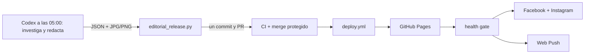

# Arquitectura editorial

## Objetivo

MR Agentes publica una noticia de IA por día para atraer lectores a la web y a sus perfiles de
Facebook e Instagram. La publicación parte de un hecho reciente y verificable. El tono es formal,
con nombres, fechas y cifras; evita el ensayo genérico y el texto publicitario.

## Un modelo, un comando, un pipeline

```mermaid
flowchart LR
    A[Codex a las 05:00: investiga y redacta] -->|JSON + JPG/PNG| B[editorial_release.py]
    B -->|un commit y PR| C[CI + merge protegido]
    C --> D[deploy.yml]
    D --> E[GitHub Pages]
    E --> F[health gate]
    F --> G[Facebook + Instagram]
    F --> H[Web Push]
```

La automatización `mr-agentes-noticias` corre una vez por día a las 05:00 de `America/Cordoba`,
en conversación nueva, con `gpt-6-luna` y esfuerzo `xhigh`. La skill
`mragentes-editorial-publisher` sólo define investigación, estilo y el formato de entrada. El
modelo entrega un JSON y una fotografía; no decide los pasos Git.

`scripts/automation/editorial_release.py` es la única autoridad local de entrega. Desde el
proyecto registrado hace `git fetch`, crea un worktree temporal en `/var/tmp` desde
`origin/main`, valida la entrada, agrega un único hecho a la cola, crea la nota y la portada,
renderiza el anuncio vertical y escribe el manifiesto y el informe. Escanea secretos, prepara
sólo esas seis rutas, crea un commit, envía `automation/editorial/YYYY-MM-DD` y abre un PR a
`main`. Usa la sesión `gh` del sistema operativo; ningún token entra al repositorio o al JSON.

El script rechaza una noticia de más de dos días, una fuente ausente, una foto inválida, una
fuente ya consumida o una nota duplicada. Una rama existente sin PR o un efecto remoto incierto
produce `needs_review`. Una nota completa de la fecha produce `skipped_valid`.

## Datos y responsables

| Dato | Autoridad |
|---|---|
| Hecho, redacción y elección de imagen | Codex, según la skill editorial |
| Cola, nota, portada, anuncio, manifiesto e informe | `editorial_release.py` |
| CI, merge protegido y Pages | GitHub Actions |
| Publicación en Facebook e Instagram | `deploy.yml`, job `publish_meta` |
| Notificación Web Push | `deploy.yml`, job `notify_push`, y Cloudflare Worker |

`.automation/schedules/editorial.json` documenta la tarea nativa. `.automation/github/editorial-egress.json`
documenta el límite de entrega del script. No hay otro cron, servicio permanente ni workflow de
ingesta editorial. Los registros nativos antiguos de blog, social y recuperación están pausados.

## Después del PR

`.github/workflows/ci.yml` prueba contratos Python, JavaScript y estilo de las notas cambiadas.
`.github/workflows/automation-intake.yml` sólo admite `automation/editorial/**` y compara el SHA
aprobado por CI con el PR antes de integrarlo. Tras el merge, despacha `deploy.yml` para ese rango
exacto. GitHub Pages publica la web. El health gate espera la URL y la imagen públicas antes de
autorizar Meta o push.

Meta permanece en el environment `meta-testing`. Su entrega reconcilia publicaciones previas y
conserva checkpoints por plataforma. Cloudflare usa un `eventId` estable para deduplicar push.
Si Facebook está confirmado e Instagram falla, sólo se recupera Instagram; un resultado incierto
se investiga antes de repetir. El frontend y la autoridad de Pages no cambian.

## Web Push

- `assets/js/push.js`: suscripción y baja iniciadas por la persona.
- `static/sw.js`: recepción y apertura segura de la notificación.
- `cf_worker.js`: validación, persistencia y envío idempotente.

`PUSH_SUBS` admite claves `sub:v1:<sha256>` y claves HTTPS legacy hasta completar su migración
perezosa. Los suscriptores no viven en Git.
